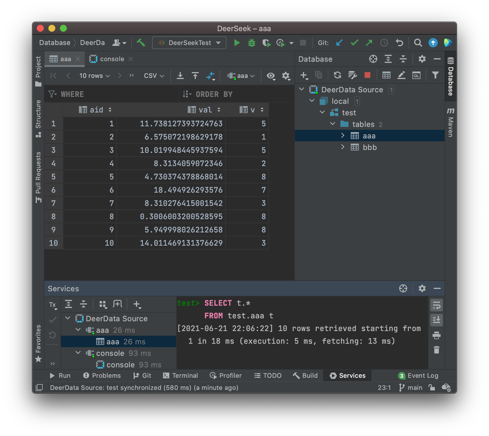

# DeerSeekDatabase

A demo database project written by Java which helps basic developers learn how to write a JDBC Driver and the theory of JDBC.


# Features

## Almost FULLY Support IntelliJ IDEA databse source interface.




## Support basic DDL. (create table, alter table)

```sql
create table sample (
    id int auto_increment primary key,
    sex bool not null,
    data double,
    description string null
);

create table sample2 (
    id int auto_increment,
    sex bool not null,
    data double,
    description string null
);
```

```sql
alter table sample2 drop data;
alter table sample2 add data double;
alter table sample2 add xxx short;
```

### Support Type List:

* BOOL
* BYTE, SHORT, INT, LONG
* FLOAT, DOUBLE
* STRING

### Support Constraint Type

* `null`(default)
* `not null`
* `auto_increment`
* `primary key`

## Support basic DML. (insert,delete,select,update)

### INSERT

```sql
insert into sample values(null,true,1.1,'hello'); -- set id null means auto add id to the column
insert into sample(sex,data) values (false,5.1);
insert into sample(sex,data) values (true,2.3);

insert into sample2 values(null,true,3.4,'hello world');
insert into sample2(sex,data,description) values (false,2.3,'ok');
```

### DELETE

Only support where clause with operator `=`,`>`,`>=`,`<`,`<=`,`is null`,`and`,`or`,`+`,`-`,`*`,`/`. **But it supports nesting like: `where colName=(select colName2 from tableName where colName3=val)`**

```sql
delete from sample where id=2;
```

Also it support `TRUNCATE TABLE tableName`.

```sql
truncate table sample;
```

### SELECT

```sql
select * from sample where id=1;
select * from sample where sex=(select sex from sample2 where description='ok') or description='hello';
```

### UPDATE

```sql
update sample set sex=false,description='wow' where data>=1 and data<3;
```


# Sample JDBC code

```java
package jackli.test;

import org.junit.Test;

import java.sql.*;

public class DeerSeekTest {
    @Test
    public void testConnection() throws Exception
    {

        Class.forName("jackli.deerseek.jdbc.Driver");
        // Replace with your path
        Connection conn = DriverManager.getConnection("jdbc:deer:/Users/jackli/tmp/test.dsdb");
        Statement st = conn.createStatement();

        System.out.println("create");

        st.execute("create table sample (\n" +
                "    id int auto_increment primary key,\n" +
                "    sex bool not null,\n" +
                "    data double,\n" +
                "    description string null\n" +
                ");\n" +
                "\n" +
                "create table sample2 (\n" +
                "    id int auto_increment,\n" +
                "    sex bool not null,\n" +
                "    data double,\n" +
                "    description string null\n" +
                ");");

        System.out.println("insert");


        st.execute("insert into sample values(null,true,1.1,'hello'); -- set id null means auto add id to the column\n" +
                "insert into sample(sex,data) values (false,5.1);\n" +
                "insert into sample(sex,data) values (true,2.3);\n" +
                "\n" +
                "insert into sample2 values(null,true,3.4,'hello world');\n" +
                "insert into sample2(sex,data,description) values (false,2.3,'ok');");

        st.execute("select * from sample");
        ResultSet rs = st.getResultSet();
        printResultSet(rs);
        rs.close();

        st.execute("select * from sample2");
        rs = st.getResultSet();
        printResultSet(rs);
        rs.close();

        System.out.println("alter");

        st.execute("alter table sample2 drop data;\n" +
                "alter table sample2 add data double;\n" +
                "alter table sample2 add xxx short;");

        st.execute("select * from sample2");
        rs = st.getResultSet();
        printResultSet(rs);
        rs.close();

        System.out.println("select * from sample where sex=(select sex from sample2 where description=?) or description=?;");
        // Support PreparedStatement
        PreparedStatement ps = conn.prepareStatement("select * from sample where sex=(select sex from sample2 where description=?) or description=?;");
        ps.setString(1,"ok");
        ps.setString(2,"hello");
        ps.execute();

        rs = ps.getResultSet();
        printResultSet(rs);
        rs.close();
        ps.close();

        rs = st.executeQuery("select * from sample where id=1;");
        printResultSet(rs);
        rs.close();

        System.out.println("update sample set sex=false,description='wow' where data>=1 and data<3;");
        st.execute("update sample set sex=false,description='wow' where data>=1 and data<3;");

        st.execute("select * from sample");
        rs = st.getResultSet();
        printResultSet(rs);
        rs.close();

        System.out.println("delete from sample where id=2;");
        st.execute("delete from sample where id=2;");

        st.execute("select * from sample");
        rs = st.getResultSet();
        printResultSet(rs);
        rs.close();

        System.out.println("truncate table sample;");
        st.execute("truncate table sample;");

        st.execute("select * from sample");
        rs = st.getResultSet();
        printResultSet(rs);
        rs.close();
        st.close();
        conn.close();
    }

    public void printResultSet(ResultSet rs) {
        try {
            ResultSetMetaData meta = rs.getMetaData();
            int len = meta.getColumnCount();
            // print title
            for (int i = 1;i <= len;i ++) {
                System.out.print(meta.getColumnName(i) + "\t");
            }
            System.out.println();

            // print body
            while (rs.next()) {
                for (int i = 1;i <= len;i ++) {
                    System.out.print(rs.getString(i) + "\t");
                }
                System.out.println();
            }

        } catch (Exception e) {
            e.printStackTrace();
        }
    }
}
```

